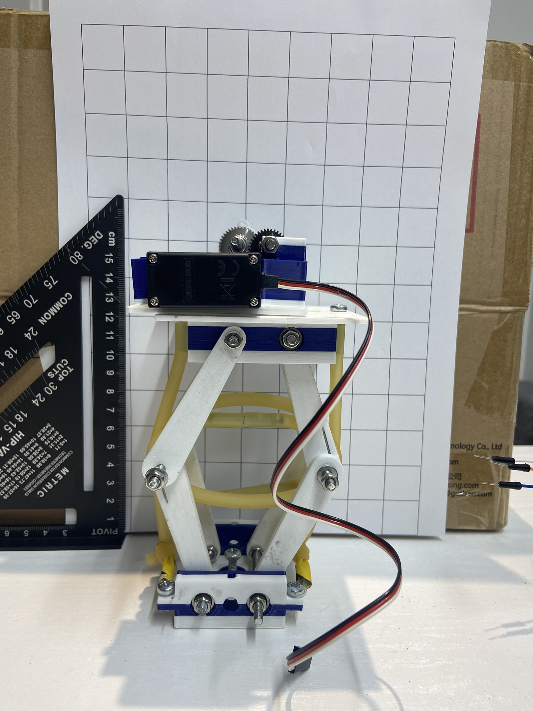
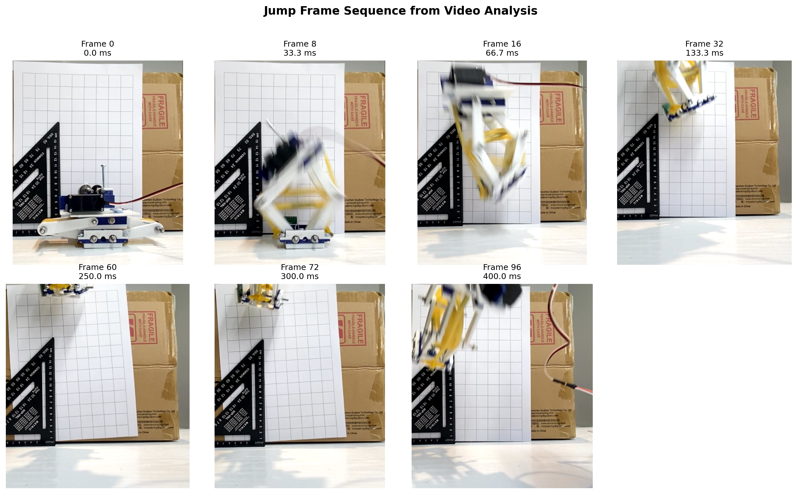

# JumpRobot

Code, analysis, images, and report files for the Design of a Small Bio-Inspired Jumping Robot for Low-Gravity Exploration.

This project investigates a small electrically wound jumping robot that stores energy in stretched latex tubing and releases it rapidly to produce a vertical jump. The repository contains the Arduino control code, Python analysis scripts, jump data plots, project images, and report material used to document the build and evaluate its performance.

## Main Components

- Arduino-Uno
- Parallax continuous-rotation servo for winding the mechanism
- 9 g servo for trigger/release actuation
- MPU6050 IMU for acceleration logging
- A1324 Hall effect sensor for position detection
- Latex tubing for elastic energy storage
- Gearbox: Steel Gears (2x 20 tooth, 1x 35 tooth, 1x 40 tooth), fishing line, shafts (M4 treaded bolts), bearings
- Torsion springs in the leg joints

## Repository Layout

- `jump_code/` - Arduino control code for the robot
- `a1324_test/` and `as5048_test/` - sensor test sketches
- `jump_calcs.py`, `plot_jump.py`, `calcs.py`, and `force_cal_*.py` - analysis and plotting scripts
- `robot_pics/` - photographs of the assembled robot and mechanical views
- `frames/` - extracted video frames used for jump analysis
- `poster/` - poster summarising the project

## 3D Printing Files and CAD

Main CAD model for the project is available on Onshape:

https://cad.onshape.com/documents/c6af172361a153a1d8cb90cb/w/e132008d8ef52e05146033e7/e/0cea18c4aa72ff65ca69552d?renderMode=0&uiState=69f7ad46af64255d2aecb767

## Example Jump Frames

